# Spreadsheet Parser

A structure-aware Excel parser that reconstructs workbook content the way a human reads it — sections, tables, key-value blocks, free text, and charts — and emits an LLM-ready JSON document model with reading order and traceability.

## Quick Start

```bash
pip install openpyxl pydantic python-dotenv google-genai openai

# Basic usage
python parser.py workbook.xlsx

# Custom output path
python parser.py workbook.xlsx -o result.json
```

The output JSON file is written to `<input_name>_output.json` by default.

### Environment Variables

| Variable | Default | Description |
|---|---|---|
| `DETECTION_TYPE` | `heuristic` | `heuristic`, `ai`, or `heuristic_then_ai` |
| `AI_DECISION_PROVIDER` | `openai` | `openai` or `gemini` for text-only LLM calls |
| `AI_MEDIA_PROVIDER` | `gemini` | `openai` or `gemini` for vision model calls |
| `OPENAI_API_KEY` | `sk-***` | API Key for OpenAI |
| `GEMINI_API_KEY` | `xxxx` | API Key for Gemini |

Create a `.env` file in the project root with your API keys.

## Pipeline Overview

```
Excel file
  │
  ▼
┌─────────────────────────────────┐
│  1. Cell Reading & Normalisation │  openpyxl
│     (merged cells, formulas,     │
│      validations, formatting)    │
└──────────────┬──────────────────┘
               │
               ▼
┌─────────────────────────────────┐
│  2. Region Splitting             │  Empty-row/col gap heuristic
│     (candidate rectangular       │
│      regions on the 2D grid)     │
└──────────────┬──────────────────┘
               │
               ▼
┌─────────────────────────────────┐
│  3. Block Detection              │  Heading → KeyValue → Text → Table
│     (classify each region)       │  Heuristic and/or AI per detector
└──────────────┬──────────────────┘
               │
               ▼
┌─────────────────────────────────┐
│  4. Chart Extraction             │  openpyxl chart objects → ChartBlock
└──────────────┬──────────────────┘
               │
               ▼
┌─────────────────────────────────┐
│  5. Grouping & Enrichment        │  Heading→content association,
│                                  │  HTML table rendering
└──────────────┬──────────────────┘
               │
               ▼
           output.json
```


## Detailed flowchart

```mermaid
flowchart TD
    START([python parser.py workbook.xlsx]) --> LOAD_WB["<b>openpyxl.load_workbook</b><br/>data_only=False<br/>formulas, formatting, charts"]
    LOAD_WB --> COMPUTE_FORMULAS["<b>_compute_formula_values</b><br/>formulas.ExcelModel().loads().finish().calculate()<br/>→ Dict[(sheet_upper, coord_upper), value]"]
    COMPUTE_FORMULAS --> LOOP_SHEETS{For each sheet<br/>in workbook.sheetnames}

    LOOP_SHEETS -->|sheet_name| TRY_SHEET["try/except per sheet<br/>(failure → empty SheetResult)"]

    TRY_SHEET --> EXTRACT["<b>SheetExtractor.extract(ws, wb, computed_values)</b>"]

    %% ---- Step 1: Read cells ----
    EXTRACT --> USED_RANGE["<b>_find_actual_used_range</b><br/>ws.calculate_dimension()<br/>if > 500K cells → scan iter_rows"]
    USED_RANGE --> MERGE_MAP["<b>_build_merge_map</b><br/>ws.merged_cells.ranges<br/>→ Dict[coord, master_coord]"]
    MERGE_MAP --> VAL_MAP["<b>_build_validation_map</b><br/>ws.data_validations<br/>→ Dict[coord, allowed_values]"]
    VAL_MAP --> READ_CELLS["<b>_read_all_cells</b><br/>For each (row, col):<br/> _read_cell(cell, merge_map, val_map, computed_values)<br/> • Resolve ArrayFormula → formula text<br/> • Resolve =formulas → computed value from lookup<br/> • Extract font, fill, merge, validation<br/>→ List[CellData]"]

    %% ---- Step 2: Region split ----
    READ_CELLS --> BUILD_GRID["<b>_build_grid</b><br/>Index cells by (row, col) for O(1) lookup"]
    BUILD_GRID --> SPLIT["<b>_split_into_regions</b><br/>1. Scan rows → find empty-row gaps → row_bands<br/>2. Scan cols → find empty-col gaps → col_bands<br/>3. Cross-product row_bands × col_bands<br/>4. Keep only regions with ≥1 non-empty cell<br/>→ List[(min_row, min_col, max_row, max_col)]"]

    %% ---- Step 3+4: Detection per region ----
    SPLIT --> LOOP_REGIONS{For each region}
    LOOP_REGIONS -->|region bounds| MAKE_REGION["<b>_make_region</b><br/>Build RegionData with cells,<br/>bounding_box, sub-grid"]
    MAKE_REGION --> HAS_CELLS{non_empty_cells?}
    HAS_CELLS -->|No| SKIP_REGION[Skip region]
    SKIP_REGION --> LOOP_REGIONS

    HAS_CELLS -->|Yes| RUN_DETECTION["<b>_run_detection(region)</b><br/>Detector chain based on DETECTION_TYPE"]

    %% ---- Detection chain ----
    RUN_DETECTION --> DET_HEADING["<b>1. HeadingDetector.detect()</b><br/>≤3 rows, ≤3 distinct values,<br/>no formulas, bold/large/merged"]
    DET_HEADING -->|HeadingBlock| BLOCK_FOUND[Block found → append]
    DET_HEADING -->|None| DET_KV

    DET_KV["<b>2. KeyValueDetector.detect()</b><br/>2–4 cols, no header row,<br/>≤2 populated cols, middle cols sparse,<br/>≥2 pairs at ≥50% coverage,<br/>keys heterogeneous"]
    DET_KV -->|KeyValueBlock| BLOCK_FOUND
    DET_KV -->|None| DET_TEXT

    DET_TEXT["<b>3. TextDetector.detect()</b><br/>≤2 occupied cols or merged,<br/>avg ≥4 words/cell,<br/>not all-bold heading"]
    DET_TEXT -->|TextBlock| BLOCK_FOUND
    DET_TEXT -->|None| DET_TABLE

    DET_TABLE["<b>4. TableDetector.detect()</b><br/>≥3 rows, ≥2 cols, ≥4 cells,<br/>≥2 occupied cols,<br/>header: bold/bg rows at top,<br/>fallback: content-based type analysis,<br/>supports headerless tables"]
    DET_TABLE -->|TableBlock| BLOCK_FOUND
    DET_TABLE -->|None| NO_MATCH[No detector matched → skip]

    BLOCK_FOUND --> LOOP_REGIONS
    NO_MATCH --> LOOP_REGIONS

    %% ---- Step 5: Charts ----
    LOOP_REGIONS -->|all regions done| CHARTS["<b>_extract_chart_blocks</b><br/>ChartExtractor.extract(ws, wb)<br/>• Title, axes, type from openpyxl<br/>• Series values from live workbook cells<br/>• Bounding box from anchor markers<br/>→ List[ChartBlock]"]

    CHARTS --> SORT["<b>Sort all blocks</b><br/>by (top_left_row, top_left_col)<br/>= reading order"]

    %% ---- Back in parser.py ----
    SORT --> ENRICH["<b>_enrich_blocks</b><br/>For each TableBlock:<br/>  render_table_html(heading, data, footer)<br/>  → populate block.html"]

    ENRICH --> GROUP["<b>group_blocks_into_chunks</b><br/>Walk sorted blocks:<br/>• If HeadingBlock + next block<br/>  row_gap ≤ 3 AND col_overlap ≥ 40%<br/>  AND next is not a heading<br/>  → merge into one chunk<br/>  (set TableBlock.title = heading text)<br/>• Else → standalone chunk"]

    GROUP --> SHEET_RESULT["SheetResult(sheet_name, chunks)"]
    SHEET_RESULT --> LOOP_SHEETS

    LOOP_SHEETS -->|all sheets done| WB_RESULT["WorkbookResult(file_name, sheets)"]
    WB_RESULT --> SERIALIZE["<b>model_dump_json</b><br/>indent=2, exclude_none=True"]
    SERIALIZE --> WRITE_FILE["Write to output.json"]
    WRITE_FILE --> DONE([Done])

    %% ---- DETECTION_TYPE branches (annotation) ----
    RUN_DETECTION -.->|"DETECTION_TYPE=ai"| AI_NOTE["Each detector calls<br/>detect_with_ai() instead<br/>→ LLM prompt + JSON parse"]
    RUN_DETECTION -.->|"DETECTION_TYPE=heuristic_then_ai"| HYBRID_NOTE["Try detect() first,<br/>if None → detect_with_ai()"]
```


## Key Design Decisions

### Treat the sheet as a sparse 2D grid, not a flat table

Excel sheets often contain multiple independent regions — side-by-side tables, form-like areas above a data table, standalone headings, footnotes. Instead of flattening, we try breaking down the table into multiple grids / regions and try identifying each of them. This is how we break down a sheet into multiple regions:

1. *Find row bands* - Scan every row in the range. A row is empty if none of the cells have a value. A continuous band of non empty rows is a row band.
2. *Find column bands* - Same logic as row bands, but for columns.
3. *Candidate regions* - Every combination of row band, column band produces a candidate rectangular region. We verify each of them to contain at least one none empty cell.

### Multi detector setup
For each block, we have a detector type against it. For example, `HeadingDetector`, `KeyValueDetector`, `TableDetector`. The detectors have heuristic logic to compute / find the corresponding type. We also support LLM based logic for detection as well.

Following are some heuristics used by different types

#### 1. Heading (Heading means a standalone section title — not a table header row)
The heading detector checks five conditions. All must pass for a region to be classified as a heading:

1. Small region: At most 3 rows tall. Headings are short — a region spanning many rows is not a heading.
2. Few distinct values: At most 3 unique non-empty cell values. A heading is typically one label (or a couple in a multi-row merged header), not a grid of varied data.
3. No formulas: Headings are plain text labels. If any cell contains a formula, it's data, not a heading.
4. At least one formatting signal: The region must have at least one of:
Bold text — any cell has font_bold = True
Large font — any cell has font_size >= 12 (the constant _HEADING_FONT_SIZE_THRESHOLD)
5. Merged cell — any cell is part of a merged range (merged_with is set)
This is the key differentiator. Without a formatting signal, a small 1–2 row text region could be anything (a note, a label, a data row). The formatting cue is what makes it "heading-like."

5. Has content: At least one non-empty cell exists.

If all five pass, the heading text is assembled by joining the values of all non-empty cells with spaces (line 65).

*What it rejects*: A bold single-row region with 4+ distinct values (probably a table header row, not a standalone heading). A 1-row region with no bold/large-font/merge (probably just a data cell). A small region with formulas (probably computed values).

#### 2. Key Value
Key value is different from table with 2 columns. Following are the conditions we test for key value regions:
1. Shape check - 2–4 columns wide, atleast 2 rows
2. No header row
3. Column density - 
    3.1 Populated column count: Count columns that have data in >50% of rows. If more than 2 columns are substantially populated, it's tabular data (like a 4-column table), not a 2-column form. Reject.
    3.2 Middle column sparsity: If there are columns between the key column (leftmost non-empty) and value column (rightmost non-empty), they must be mostly empty (≤30% filled). This allows a thin spacer/gap column between key and value, but rejects regions where intermediate columns carry data.
4. Pair building and coverage - Walk through each row. The key cell should be label-like. The value cell should be value-like (not null). There should be at least 2 valid pairs and pairs must cover 50% or more of the region's rows
5. Key heterogeneity -  checks whether the key column values are diverse field labels (good for key-value) or repetitive instances of the same category (which means it's actually a table).


#### 3. Table
The table detector is the fallback — it runs last in the chain, so by the time a region reaches it, the heading, key-value, and text detectors have already rejected it. The heuristic is deliberately permissive.

1. Minimum size - Atleast 3 rows and 2 columns, at least 4 non empty cells
2. Column spread - Data must actually occupy at least 2 distinct columns. A region that spans 3 columns but only has data in column A is not a table — it's more likely text or a list.


#### 4. Text
All of the following must pass:
1. Narrow column span - Must occupy atmost 2 columns with data. Free text lives in a single column (or a wide merged cell spanning many columns)
2. Prose-like word density - The average word count per non-empty cell must be ≥ 4 words
3. Not a heading in disguise - If the region is ≤ 2 rows and all cells are bold, it looks like a heading that somehow wasn't caught by the heading detector. Reject it here to avoid misclassifying a bold section title as a text block.


### Header vs Row classification
Every non-empty row is scanned top-to-bottom and classified as either a header row or a body row. 

#### Formatting based condition
A row is a header row if one of the following holds:
1. All non empty cells in the row are bold
2. All non empty cells in the row have a background color

*Constraint*: A row can only be header if no body row has been seen yet. Once a body row is seen, all subsequent rows are body regardless of formatting.

#### Content based fallback
When no rows gets tagged as header by the formatting based checks, we fallback to looking towards content.
1. Check A — Type mismatch → first row IS a header. For each column, classify the first row's value and the body rows' values into type buckets (text, numeric, formula, empty). If any column has a text value in the first row but ≥60% numeric values in the body, the first row is a label header.
2. Check B — Type match → first row is NOT a header (headerless table): For each column, find the dominant type in the body rows. If the first row's type matches the body's dominant type in ≥80% of columns, the first row is data, not a header.


### Heuristic-first, LLM as refinement

LLM calls are expensive and slow. The pipeline uses fast heuristic detectors as the first pass and only calls the LLM when heuristics are inconclusive (controlled by `DETECTION_TYPE`). In pure `heuristic` mode, no LLM calls are made at all.

### Detection chain with priority ordering

Each candidate region is run through detectors in a fixed order: **Heading → Key-Value → Text → Table**. The first detector that returns a match wins. This ordering matters:

- Headings are checked first because they are the most constrained (small, bold, no formulas) and would otherwise be misclassified as single-row tables.
- Key-value regions are checked before tables because a 2-column form layout looks like a 2-column table to a generic table detector.
- Text is checked before table because a paragraph of notes in a merged cell is not a table.
- Table is the fallback — if nothing else matched, it's probably tabular data.

### Compact LLM prompts

When AI detection is used, cell data is sent to the LLM in a compact one-line-per-cell format that only includes non-null fields. For example:

```
[A1] | val="Revenue" | bold | bg=#4472C4
[A2] | val="1200000" | formula==SUM(B2:B10)
```

This drastically reduces token count compared to verbose key-value serialisation of every field.
